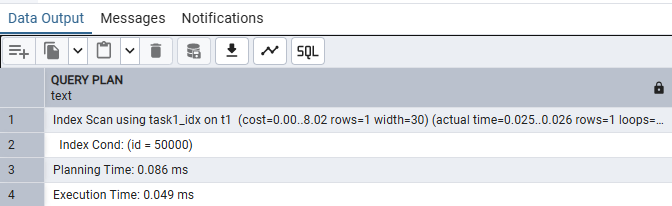
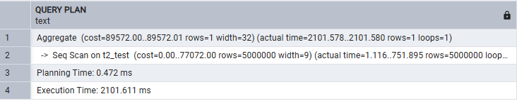
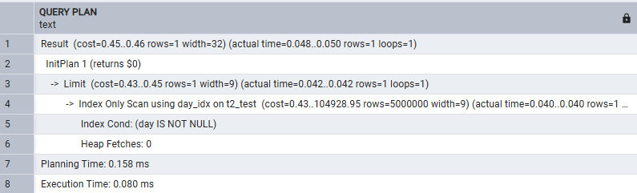
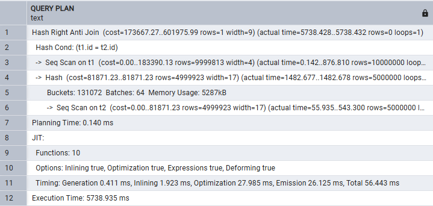
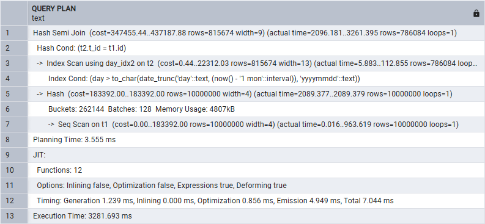

# Тестовое задание команды системной производительности 
**Александр Дашкевич, 2025**

## Задача 1

### Условие: 
> Ускорить простой запроc, добиться времени выполнения < 10ms:
> ``` select name from t1 where id = 50000; ```

### Решение: 

Время выполнения данного запроса без изменений более 1000 мс. Это происходит из-за того, что СУБД использует Seq Scan, а именно построчный последовательный перебор значений.
Для ускорения выполнения запроса создадим индекс с хеш-алгоритмом. Мы можем его выбрать, потому что запрос использует только оператор сравнения "=" и ожидаемая асимптотика нахождения значения О(1), так как коллизий не должно быть из-за уникальных значений id. Это позволит добиться самое быстрое время выполнение среди всех алгоритмов индексов. 
Query plan после создания индекса:



## Задача 2

### Условие:
> Ускорить запрос "max + left join", добиться времени выполнения < 10ms:
> ``` select max(t2.day) from t2 left join t1 on t2.t_id = t1.id and t1.name like 'a%'; ```

### Решение: 

Больше всего времени в данном запросе съедает LEFT JOIN, поэтому создадим материализованное представление, чтобы просчитать таблицу заранее.
После создания представления время выполнения запроса сократилось, однако этого недостаточно.



Поэтому создадим индекс для представления по day с сортировкой по убыванию для быстрого получения max.
Query plan:



## Задача 3

### Условие:
> Ускорить запрос "anti-join", добиться времени выполнения < 10sec:
> ``` select day from t2 where t_id not in ( select t1.id from t1 ); ```

### Решение:

В данном запросе использование NOT IN неэффективно, так как SQL приходится сначала полностью выполнить подзапрос, чтобы перейти к следующему значению, а при большом объеме данных это очень долго.
Поэтому заменим NOT IN на NOT EXISTS, так как второй может остановиться при первом совпадении, что будет в разы эффективнее. Полученный запрос: ``` SELECT day FROM t2 WHERE NOT EXISTS ( SELECT 1 FROM t1 WHERE t1.id = t2.id ) ```
Query plan:



## Задача 4

### Условие:
> Ускорить запрос "semi-join", добиться времени выполнения < 10sec:
> ``` select day from t2 where t_id in ( select t1.id from t1 where t2.t_id = t1.id) and day > to_char(date_trunc('day',now()- '1 months'::interval),'yyyymmdd'); ```

### Решение:

Аналогично прошлой задаче заменим IN на EXISTS. После замены время работы стало ~6 sec. Помимо этого создадим индекс по полю day таблицы t2 для ускорения сравнения во втором условии.
Query plan:


